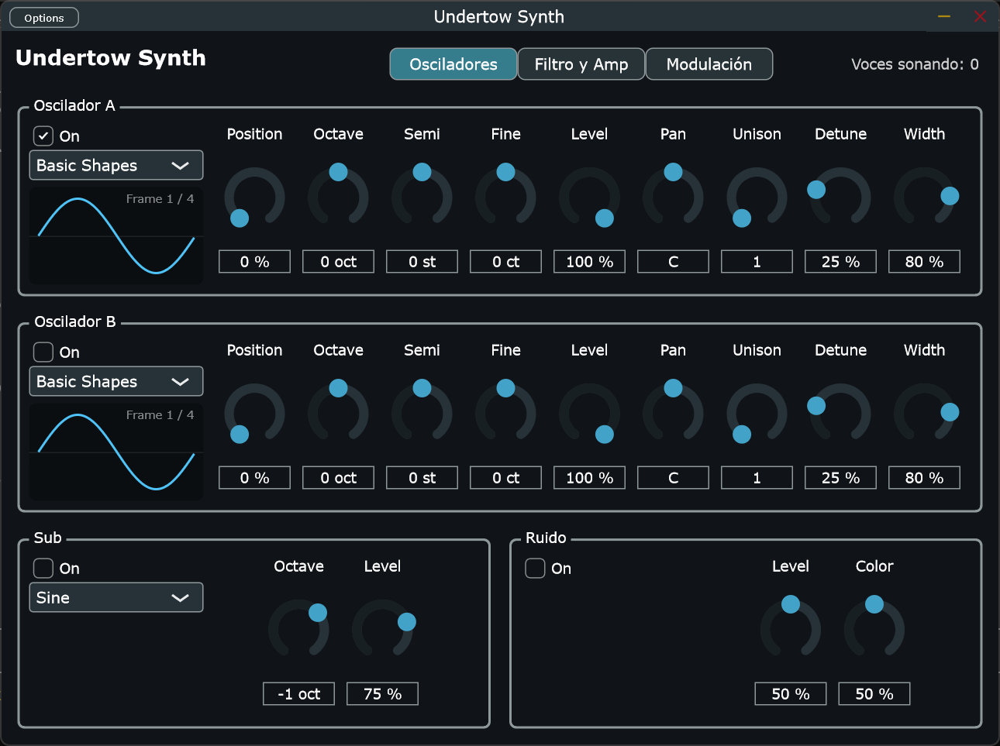

# Undertow Synth

Sintetizador **wavetable polifónico** en formato VST3 y Standalone para Windows, escrito en C++20 con JUCE.
Es un proyecto de aprendizaje de programación de audio y diseño sonoro, construido por fases, con la meta de
llegar al nivel de sintes como Serum o Vital.



> **Estado:** en desarrollo (fases 1–6 de 11 completadas). Ya suena y es usable en un DAW, pero todavía no tiene
> FM, efectos ni presets. Ver la [hoja de ruta](#hoja-de-ruta).

## Qué tiene hoy

- **Dos osciladores wavetable sin aliasing (A y B):** mipmaps por octava, interpolación cúbica y morphing continuo
  entre frames. Tiene 5 tablas de fábrica: *Basic Shapes*, *Pulse Width*, *Harmonic Build*, *Hard Sync* y *Vowels*.
- **Unison de hasta 16 copias por oscilador,** con detune, ancho estéreo y paneo. El volumen se mantiene al cambiar
  el número de copias y ninguna copia produce aliasing.
- **Sub-oscilador** (seno, triángulo, sierra o cuadrada, de 0 a −3 octavas) y **ruido** con control de color.
- **Filtro ZDF/TPT:** Low Pass, High Pass y Band Pass de 12 o 24 dB/octava, con resonancia, drive y key tracking.
  Incluye un visor de la curva de respuesta.
- **Modulación:** 2 envolventes extra (Env 2 y Env 3), 2 LFOs (6 formas, sincronizables al tempo, modos Free,
  Retrigger y One Shot) y una matriz de 8 rutas. Fuentes: envolventes, LFOs, velocity, nota, rueda de modulación y
  aftertouch. Destinos: posición, tono, nivel y detune de cada oscilador, tono global, nivel del sub y del ruido,
  cutoff, resonancia, drive y volumen.
- **Polifonía de 1 a 16 voces** con robo de voces sin clics, pedal de sustain (CC64) y CC120/123.
- **Envolvente ADSR** exponencial y sensibilidad a la velocity.
- Correcto a 44.1, 48, 88.2 y 96 kHz y con cualquier tamaño de buffer. Validado con
  [pluginval](https://github.com/Tracktion/pluginval) en strictness 10.

## Requisitos

- Windows 10/11 de 64 bits.
- [Visual Studio 2022](https://visualstudio.microsoft.com/es/vs/community/) (Community sirve), con el workload
  **"Desarrollo para el escritorio con C++"**.
- [CMake](https://cmake.org/download/) 3.22 o superior.
- Git. JUCE 9.0.2 se descarga solo durante la configuración (no hace falta instalarlo).

No hay binarios publicados todavía: hay que compilarlo (son 3 comandos).

## Compilar

```bash
git clone https://github.com/EduardoCamposCasillas/undertow-synth.git
cd undertow-synth
cmake -B build -G "Visual Studio 17 2022" -A x64
cmake --build build --config Release
```

La primera configuración tarda unos minutos porque descarga JUCE. Al terminar tendrás:

| Formato | Ruta |
|---|---|
| VST3 | `build/UndertowSynth_artefacts/Release/VST3/Undertow Synth.vst3` |
| Standalone | `build/UndertowSynth_artefacts/Release/Standalone/Undertow Synth.exe` |

Si `cmake` no se reconoce, usa la ruta completa (`"C:\Program Files\CMake\bin\cmake.exe"`) o agrégalo al PATH.

### Tests

```bash
ctest --test-dir build -C Release --output-on-failure
```

Los tests (`tests/DspTests.cpp`) miden afinación, aliasing, respuesta del filtro, ausencia de clics y coste de CPU.

## Usarlo

### Standalone (la forma más rápida de probarlo)

1. Abre `Undertow Synth.exe`.
2. En **Options → Audio/MIDI Settings** elige tu tarjeta de sonido y activa tu teclado MIDI.
3. Toca. Sin teclado MIDI, lo más cómodo es usarlo dentro de un DAW.

### En FL Studio

1. Copia la carpeta `Undertow Synth.vst3` a `C:\Program Files\Common Files\VST3` (requiere administrador).
   También puedes agregar `build/UndertowSynth_artefacts/Release/VST3` como carpeta de búsqueda.
2. **Options → Manage plugins**. Si agregaste una carpeta propia, márcala como tipo **VST3**: si queda como VST2,
   FL no encuentra el plugin. Pulsa **Find installed plugins**.
3. En el Channel Rack: **+ → Undertow Synth**.

En otros DAWs (Ableton, Reaper, Bitwig…) funciona igual: hay que reescanear la carpeta VST3.

### Controles

**Pestaña Osciladores: Oscilador A y Oscilador B** (B viene apagado)
| Control | Qué hace |
|---|---|
| On | Enciende o apaga el oscilador (con un fundido corto: sin clics). |
| Wavetable | Elige la familia de timbres. Cambiarla con notas sonando no produce clics. |
| Position | Recorre los frames de la tabla. En *Basic Shapes*: 0 % seno, 33 % triángulo, 67 % sierra y 100 % cuadrada. |
| Octave / Semi / Fine | Afinación: ±4 octavas, ±12 semitonos y ±100 cents. |
| Level / Pan | Volumen del oscilador y posición en el estéreo. |
| Unison | Cuántas copias de la onda suenan a la vez (1 a 16). |
| Detune | Cuánto se desafinan las copias entre sí (hasta ±1 semitono). Poco = coro suave; mucho = supersaw. |
| Width | Cuánto se abren las copias hacia izquierda y derecha. |

**Sub y Ruido**
| Control | Qué hace |
|---|---|
| Sub: forma, Octave, Level | Un oscilador simple por debajo de la nota (mono, siempre al centro) para dar peso en los graves. |
| Ruido: Level, Color | Ruido para aire, ataques o texturas. Color 0 % = grave y oscuro, 50 % = blanco, 100 % = solo agudos. |

**Pestaña Filtro y Amp: filtro**
| Control | Qué hace |
|---|---|
| On | Enciende el filtro. Viene apagado por defecto. |
| Tipo | Low Pass (oscurece), High Pass (adelgaza) o Band Pass (suena nasal, tipo "wah"). |
| 12 / 24 dB | La pendiente: 12 dB da un corte suave y 24 dB uno más oscuro y marcado. |
| Cutoff | Dónde empieza a actuar el filtro (de 20 Hz a 20 kHz). |
| Resonance | Crea un pico en el cutoff: da presencia y, alta, suena "ácido". |
| Drive | Satura la señal antes del filtro: más armónicos y más agresividad. |
| Key Track | Hace que el cutoff siga a la nota; al 100 %, todo el teclado tiene el mismo brillo. |

**Envolvente de amplitud y voz**
| Control | Qué hace |
|---|---|
| Attack / Decay / Sustain / Release | Forma del volumen de cada nota en el tiempo. |
| Voices | Máximo de notas simultáneas (de 1 a 16). Con 1 es monofónico, ideal para bajos y leads. |
| Velocity | Cuánto afecta la fuerza de la tecla al volumen. |
| Master | Volumen de salida. |

**Pestaña Modulación**
| Control | Qué hace |
|---|---|
| LFO 1 / LFO 2 | Forma (Sine, Triangle, Saw Up/Down, Square, Sample & Hold) y modo: *Retrigger* reinicia el ciclo en cada nota, *Free* usa un reloj común (con Sync, ligado al compás) y *One Shot* hace un solo ciclo. |
| Sync / Rate / Division | Sin Sync, la velocidad va en Hz (0.02–40 Hz). Con Sync, en figuras musicales (de 8 compases a 1/32, con tresillos y puntillos). |
| Env 2 / Env 3 | Envolventes ADSR que no mueven el volumen, sino lo que se les conecte. |
| Matriz (8 rutas) | Fuente → destino con un amount de −100 % a +100 %. El 100 % recorre toda la perilla del destino (Cutoff: 10 octavas; Pitch: ±24 semitonos). Doble clic en la barra = 0 %. |

Todos los parámetros se pueden automatizar desde el DAW (en FL: clic derecho → *Create automation clip*).

### Primer sonido: bajo analógico

*Basic Shapes*, Position **67 %** · Voices **1** · Filtro **On**, **Low Pass 24 dB**, Cutoff **450 Hz**,
Resonance **25 %**, Drive **30 %**, Key Track **50 %** · Attack **2 ms**, Decay **300 ms**, Sustain **60 %**,
Release **60 ms**. Toca corcheas entre C3 y C4 (notación de FL).

Para darle el "squelch" de un acid: Resonance **75 %** y, en la pestaña Modulación, Env 2 (Attack 1 ms, Decay 180 ms,
Sustain 0 %) con la ruta **Env 2 → Filter Cutoff +40 %**.

Hay más recetas, ejercicios de escucha y vocabulario en **[APRENDIZAJE.md](APRENDIZAJE.md)**, el cuaderno de
diseño sonoro del proyecto. Explica qué se oye con cada control y por qué.

## Estructura del código

```
Source/
  PluginProcessor.*   parámetros, estado y processBlock
  PluginEditor.*      interfaz
  dsp/                oscilador con unison, wavetables, ruido, filtro, envolvente, LFO y FFT (sin JUCE)
  synth/              voces, gestión de polifonía, matriz de modulación y banco de wavetables
  gui/                visores propios (forma de onda, curva del filtro y LFO)
tests/                tests de DSP (ejecutable independiente, sin JUCE)
```

El DSP no depende de JUCE: se puede probar aislado. Dentro del hilo de audio no se reserva memoria ni se usan locks.

## Hoja de ruta

- [x] 1 — Proyecto base, VST3 + Standalone
- [x] 2 — Polifonía y envolvente ADSR
- [x] 3 — Oscilador wavetable sin aliasing
- [x] 4 — Filtros ZDF/TPT
- [x] 5 — Modulación: envolventes extra, LFOs y matriz de modulación
- [x] 6 — Segundo oscilador, sub, ruido y unison
- [ ] 7 — FM, ring mod y modos de warp
- [ ] 8 — Efectos: distorsión, chorus, delay y reverb
- [ ] 9 — Interfaz profesional
- [ ] 10 — Presets y librería de sonidos
- [ ] 11 — Optimización y pulido

**Límites conocidos:**
- El drive del filtro todavía no tiene oversampling. Con drive alto en notas muy agudas puede aparecer algo de
  aliasing. Se resolverá en la fase 7/8.
- El unison es caro con todo al máximo (16 notas con los dos osciladores a 16 copias ≈ 65–80 % de un núcleo). Un
  supersaw normal (8 notas, 7 copias) cuesta ≈ 9 %. La optimización con SIMD llega en la fase 11.

## Licencia

[GNU AGPLv3](LICENSE). Undertow Synth usa [JUCE](https://juce.com), que se distribuye bajo AGPLv3 o bajo una
licencia comercial.
